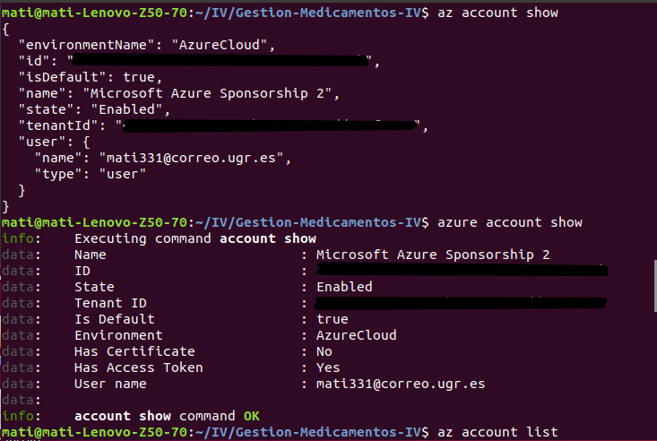
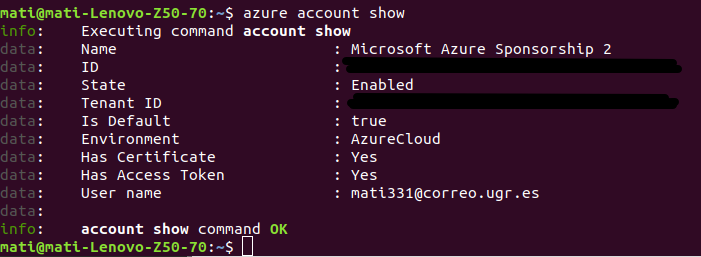
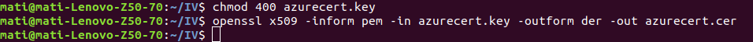
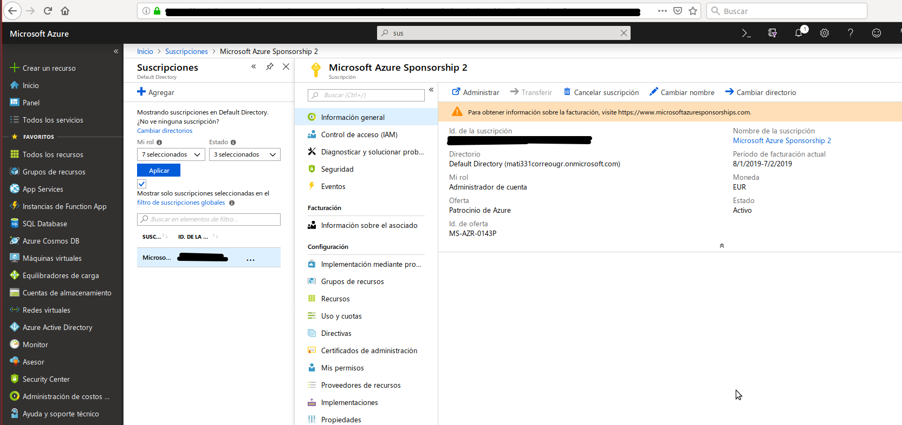
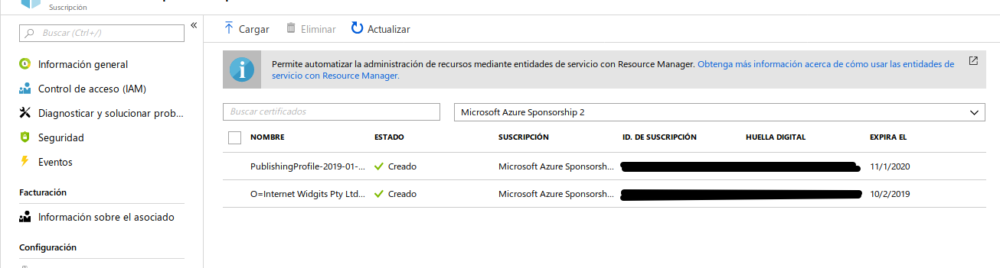
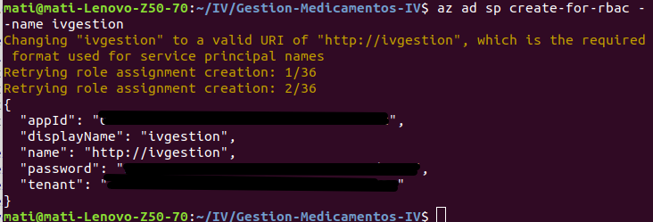
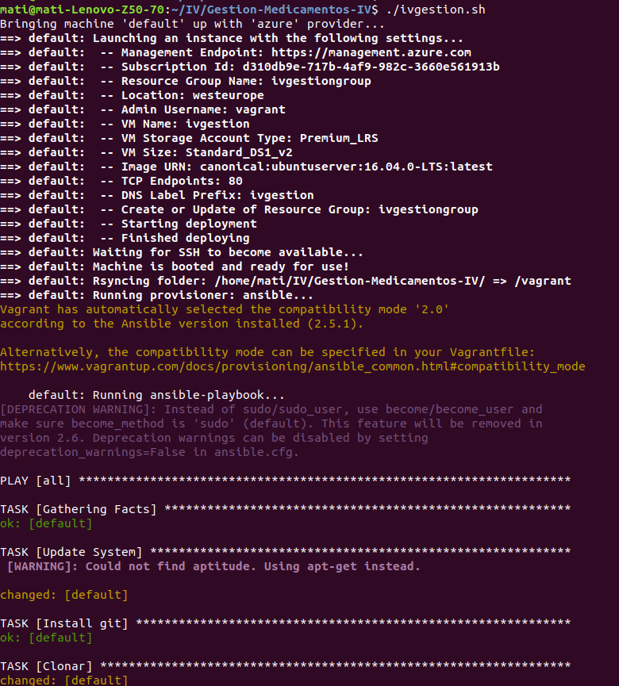

## Despliegue de la aplicación en Azure.

Para el despliegue en azure hemos elegido, para  la orquestación de maquinas virtuales Vagrant, para el aprovisionamiento Ansible, para el despliegue Fabric.

### Ansible

Ansible es un motor de orquestación muy simple que automatiza toda clase de tareas necesarias para el aprovisionamiento de nuestra maquina. La hemos elegido porque es open-source y por la gran comunidad que la respalda, la documentación es excepcional.  

Lo primero que hacemos es una prueba en local para gestionar con ansible una maquina virtual creada con vagran que clone nuestro repositorio e instale todo lo necesario.

Con Vagrant init tenemos nuestro archivo Vagrantfile, el cual modificamos para que quede así:

    Vagrant.configure('2') do |config|

      config.vm.box = "bento/ubuntu-16.04"
      config.vm.network "forwarded_port", guest: 4567, host: 80, host_ip: "0.0.0.0"

      config.vm.network "private_network", ip: "192.168.56.100"

      config.vm.provision :ansible do |ansible|
          ansible.playbook = "provision/playbook.yml"
      end

    end

Instalo ansible con: sudo apt install ansible

Genero archivo ansible playbook.yml el cual queda así:

    - hosts: all
      sudo: yes
      remote_user: vagrant   
      tasks:

      - name: Update System
        apt:
          update_cache=yes  
          upgrade=yes  

      - name: Install git
        apt: pkg=git state=present
      - name: Clonar
        git:  repo=https://github.com/mati3/Gestion-Medicamentos-IV.git dest=Gestion-Medicamentos-IV/ clone=yes force=yes  

      - name: Install dependencies
        apt: pkg={{item}} state=latest
        with_items:
          - build-essential
          - ruby
          - rubygems

      - gem:
          name=rake
          state=present

      - name: Install bundle  
        become: yes
        command:
          bash -lc "gem install bundle"

      - bundler:
          state=present
          gemfile=Gestion-Medicamentos-IV/Gemfile
          deployment_mode=yes

Nota: Para errores  en la sintaxis de [YAML](http://wiki.ess3.net/yaml).

[Link al archivo playbook.yml](../provision/playbook.yml)

[Link a la explicacion extendida de Ansible.](ansible.md)

Ejecuto en terminal: vagrant up, vagrant ssh, cd /vagrant, compruebo que esta todo instalado. Primera parte realizada.

**Levantamos el servicio y comprobamos en el navegador:**

### Configuración Azure

Ya tenemos cuenta en Azure aunque no le hayamos dado uso, así que, lo primero que hacemos es instalar el cliente [(Azure-Cli)](https://docs.microsoft.com/es-es/cli/azure/install-azure-cli-apt?view=azure-cli-latest) para la creación y orquestación de maquinas virtuales en el propio Azure. Esto nos ha dado bastantes problemas, al final la solución buena para mi fue:

**Ejecutamos el siguiente comando :**

    sudo apt-get update & sudo apt-get install -y libssl-dev libffi-dev & sudo apt-get install -y python-dev

**Instalamos azure-cli con:**

    curl -L https://aka.ms/InstallAzureCli | bash

Con az login la propia terminal te da un codigo de autentificación y la web donde tienes que ponerlo.

Podemos comprobar nuestras suscripciones con:

    azure account list

ó

    az account list

Para obtener los detalles de la suscripción activa:

    az account show

[Link a comandos az](https://docs.microsoft.com/en-us/cli/azure/account?view=azure-cli-latest)

Vemos que no tenemos el certificado en la imagen anterior.

**Preparamos el entorno de Cli de Azure en modo [Service Manager](https://docs.microsoft.com/es-es/azure/azure-resource-manager/resource-manager-deployment-model).**

Modelo de despliegue basado en el Servicio, el Cloud Service actua como un contenedor para hospedar los servicios, con todos sus componentes, ya sean interfaces de red, Direcciones IP públicas, nombres DNS, así como balanceador/equilibrador de carga, Endpoints de acceso ya sea via Powershell, RDP o SSH.
Asimismo se agrega el almacenamiento necesario donde ubicar los discos duros virtuales para una máquina virtual, incluido el sistema operativo, discos de datos temporales y adicionales, se incluiría una red virtual opcional que actúa como un contenedor adicional, en el que se puede crear una estructura de subredes y designar la subred en la que se encuentra nuestro Cloud Service. [Link a la explicación](http://blogs.itpro.es/rtejero/2017/11/24/azure-service-manager-asm-vs-azure-resource-manager-arm-hagomigrome-actualizo/)

    azure config mode asm

Acto seguido descargo el archivo de configuración de publicación que se utiliza para autenticar a través de autenticación basada en certificados para las API de ASM.

    azure account download

Nos dirigimos al link que nos muestra la terminal. Validamos y descargamos:

Importamos el archivo descargado, las credendiales.

Como podemos ver ya si tenemos el certificado.

Ahora vamos con la seguridad. Aprovechamos los conocimientos adquiridos en SPSI. Creamos un certificado autofirmado llamado "azurecert.key"

**Certificado:**

Como azure no admite certificados .pem, cambiamos el formato del certificado a un .cert, al que llamamos "azurecert.cer"

Para los certificados, quitar permisos del archivo y solo permitir leer el archivo al propietario.

Subimos el archivo a Azure, [guia para subir un certificado](https://docs.microsoft.com/es-es/azure/azure-api-management-certs)

Si queremos asignarle roles, como mínimo seremos colaborador. Centro de acceso (IAM) -> Agregar asignación de roles.

Por ultimo creamos un servicio principal.

### Vagrant

Vamos a usar vagrant para crear y manejar nuestra maquina virtual en Azure, necesitamos un archivo Vagrantfile, con el cual definiremos el tipo de maquina requerida para nuestro proyecto y la aprovisionaremos.

[Nuestro Vagrantfile](../Vagrantfile)

[Link a la documentación detallada de vagrant](vagrantfile.md)

Creamos la maquina virtual y todo lo necesario en Azure desde nuestra terminal:

### Fabric

Para facilitar la administración y automatizar el despliegue en remoto, usamos Fabric.

Instalo con la orden "sudo pip install -U 'fabric<2' ".

Creamos una carpeta llamada "despliegue" donde generamos nuestro "fabfile.py", el cual queda con el siguiente aspecto:

      from fabric.api import *

      def Remove():
      	run('sudo rm -rf ./Gestion-Medicamentos-IV')

      def Install():
      	Remove()
      	run('git clone https://github.com/mati3/Gestion-Medicamentos-IV.git')
      	run('cd Gestion-Medicamentos-IV && bundle install')

      def Run():
      	run('cd Gestion-Medicamentos-IV && sudo bundle exec rackup',pty=False)

      def Update():
      	Install()
      	Run()

### Ejecución

Para probar la ejecución de nuestra aplicación con Fabric ejecutamos desde terminal:

    fab -f despliegue/fabfile.py -H vagrant@ivgestion.westeurope.cloudapp.azure.com Run

Para hacerlo todo en una sola orden, creamos un script que levanta vagrant y despliega con fabric:

      #!/bin/bash

      vagrant up --provider=azure
      fab -f despliegue/fabfile.py -H vagrant@ivgestion.westeurope.cloudapp.azure.com Run

Ejecutamos para comprobar mi aplicación:

    ./ivgestion.sh

Vamos al navegador y probamos:

