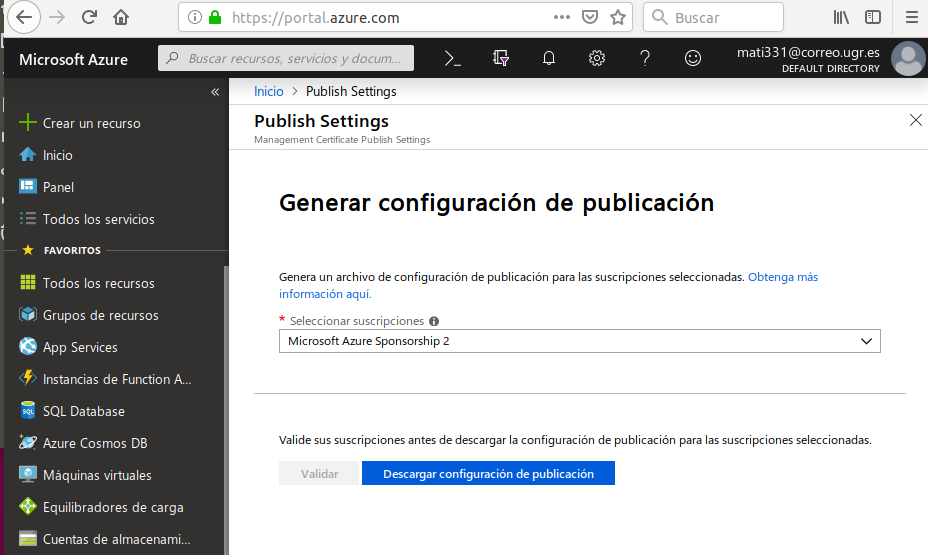
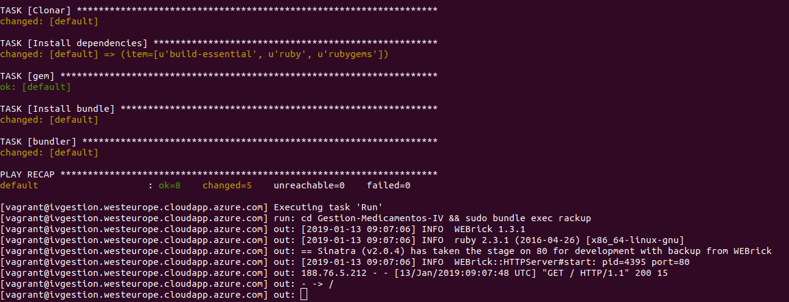

## Despliegue de la aplicación en Azure.

Lo primero que hacemos es una prueba en local para gestionar con ansible una maquina virtual creada con vagran que clone nuestro repositorio e instale todo lo necesario.

Con Vagrant init tenemos nuestro archivo Vagrantfile, el cual modificamos para que quede así:

    Vagrant.configure("2") do |config|

      config.vm.box = "bento/ubuntu-18.04"
      config.vm.network "forwarded_port", guest: 4567, host: 80, host_ip: "0.0.0.0"

      config.vm.provision "ansible" do |ansible|
          ansible.sudo = true
          ansible.playbook = "ansible.yml"
          ansible.verbose = "v"
          ansible.host_key_checking = false
      end

Instalo ansible con: sudo apt install ansible

Genero archivo ansible playbook.yml el cual queda así:

      - hosts: all
      sudo: yes
      remote_user: vagrant   
      tasks:
      - name: Actualizar sistema
      apt: update_cache=yes     	
      - name: Install git
      apt: pkg=git state=present
      - name: Clonar
      git:  repo=https://github.com/mati3/Gestion-Medicamentos-IV.git dest=Gestion-Medicamentos-IV/ clone=yes force=yes  
      - name: Build-essential
      apt: pkg=build-essential state=present     
      - name: Instala Ruby
      apt: pkg=ruby state=present
      - gem:
          name=sinatra
          state=latest
      - gem:
          name=bundle
          state=latest

Nota: Para errores  en la sintaxis de [YAML](http://wiki.ess3.net/yaml). Errores varios con [vagrant y ansible](http://databaseindex.blogspot.com/2018/03/)

Ejecuto en terminal: vagrant up, vagrant ssh, cd /vagrant, compruebo que esta todo instalado. Primera parte realizada.

Buscamos una guía de aprovisionamiento de [Azure con Vagrant](https://unindented.org/articles/provision-azure-boxes-with-vagrant/) para nuestras pruebas.

Ya tenemos cuenta en Azure aunque no le hayamos dado uso, así que, lo primero que hacemos es instalar el cliente [(Azure-Cli)](https://docs.microsoft.com/es-es/cli/azure/install-azure-cli-apt?view=azure-cli-latest) para la creación y orquestación de maquinas virtuales en el propio Azure. Esto nos ha dado bastantes problemas, al final la solución buena para mi fue:

Ejecutamos los siguientes comandos:

 sudo apt-get update & sudo apt-get install -y libssl-dev libffi-dev & sudo apt-get install -y python-dev

 Despues instalamos nuevamente azure-cli con:

 curl -L https://aka.ms/InstallAzureCli | bash

Con az login la propia terminal te da un codigo de autentificación y la web donde tienes que ponerlo.

Preparamos el entorno de Cli de Azure en modo [Resource Manager](https://docs.microsoft.com/es-es/azure/virtual-machines/azure-cli-arm-commands). Enlace a blog donde se explica que es el modelo de implementación [Resource Manager](https://www.kabel.es/azure-classic-o-azure-resource-manager/) y sus ventajas.

Nos dirigimos al link que nos muestra la terminal. Validamos y descargamos:

Importamos el archivo descargado, las credendiales.

Ahora vamos con la seguridad. Aprovechamos los conocimientos adquiridos en SPSI. Creamos un certificado autofirmado llamado "azurecert.key"

Como azure no admite certificados .pem, cambiamos el formato del certificado a un .cert, al que llamamos "azurecert.cer"

Subimos el archivo a Azure, [guia para subir un certificado](https://docs.microsoft.com/es-es/azure/azure-api-management-certs)
s

Volvemos a la terminal y preparamos el entorno:

Si queremos asignarle roles, como mínimo seremos colaborador. Centro de acceso (IAM) -> Agregar asignación de roles.

Vamos a comprobar nuestra cuenta desde terminal (por ser información sensible oculto id). Esta información nos servirá cuando creemos nuestro Vagranfile.

Vemos las distribuciones Ubuntu que tenemos disponibles en Azure. Tendriamos que instalar un sistema operativo que cubra las necesidades de nuestra aplicación, con la distribución mas ligera, nos decidimos por Ubuntu porque es la versión mas estable de Linux y es con la que trabajamos habitualmente.

Vemos donde podemos aprovisionar nuestra máquina virtual:

Creamos la MV con vagrant. Necesitamos un Vagranfile.

Desde terminal ponemos vagrant init. Esto nos genera un archivo Vagrantfile el cual vamos a modificar con la información de Azure.

      Vagrant.configure('2') do |config|
        config.vm.box = 'azure'

        # use local ssh key to connect to remote vagrant box
        config.ssh.private_key_path = '~/.ssh/id_rsa'
        #config.vm.network "forwarded_port", guest: 80, host: 80
        #config.vm.network "forwarded_port", guest: 4567, host: 80
        #config.vm.network "public_network"
        #config.vm.hostname = "localhost"

        config.vm.provider :azure do |azure, override|

          azure.tenant_id = ENV['AZURE_TENANT_ID']
          azure.client_id = ENV['AZURE_CLIENT_ID']
          azure.client_secret = ENV['AZURE_CLIENT_SECRET']
      	  azure.subscription_id = ENV['AZURE_SUBSCRIPTION_ID']

          azure.vm_image_urn = 'Canonical:UbuntuServer:16.04-LTS:16.04.201612210'
          azure.resource_group_name = 'ivgestiongroup'
          azure.location = 'westeurope'  
          azure.vm_size = 'Standard_DS1_v2'
          azure.tcp_endpoints = '80'

        end

        config.vm.provision :ansible do |ansible|
            ansible.playbook = "provision/playbook.yml"
        end

      end

Creamos la maquina virtual y todo lo necesario en Azure desde nuestra terminal:

Para facilitar la implementación y la administración usamos Fabric, lo con la orden "sudo pip install -U 'fabric<2' " creamos una carpeta llamada "despliegue" donde generamos nuestro "fabfile.py", el cual queda con el siguiente aspecto:

      from fabric.api import *

      def Instalar():
      	""" Clonar repositorio """

      	run('git clone https://github.com/mati3/Gestion-Medicamentos-IV.git')

      	run('sudo apt-get update')
      	run('sudo apt-get upgrade')
      	run('sudo apt install build-essential')
      	run('sudo apt install ruby')
      	run('sudo gem install sinatra')
      	run('sudo gem install bundle')
      	run('cd Gestion-Medicamentos-IV && bundle install')

      def Eliminar():
      	""" Eliminar el repositorio """

      	run('sudo rm -rf ./Gestion-Medicamentos-IV')

      def Iniciar():
      	""" Run """
      	run('cd Gestion-Medicamentos-IV && bundle exec rackup')

Para probar la ejecución de nuestra aplicación con Fabric ejecutamos desde terminal:

fab -f despliegue/fabfile.py -H vagrant@ivgestion-ip.cloudapp.azure.com Iniciar

Vamos al navegador y probamos:

