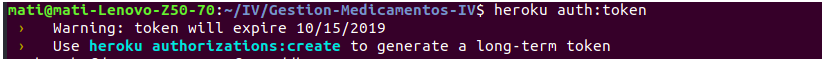
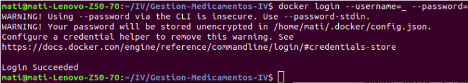
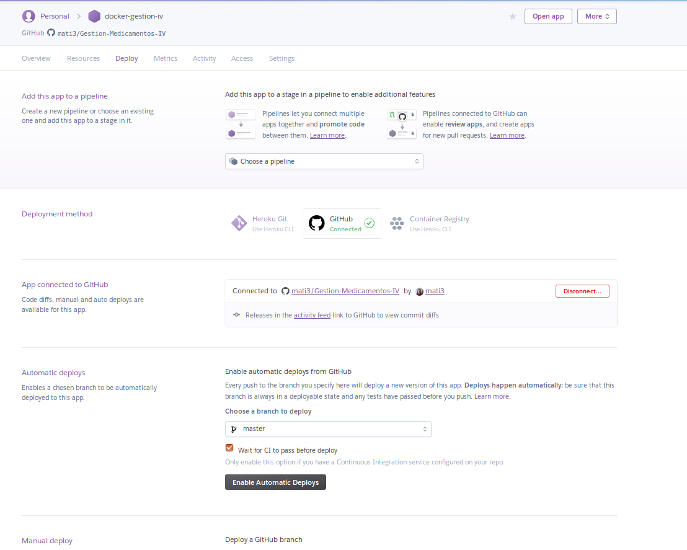
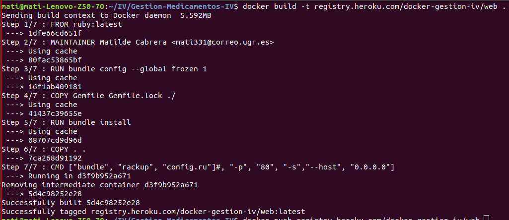
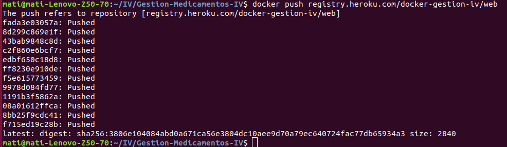
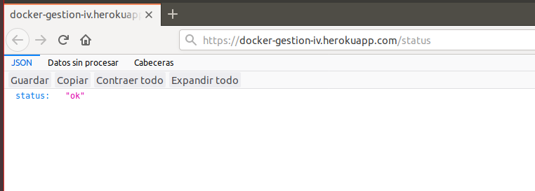

## Despliegue en Heroku de nuestro contenedor Docker, alojado en DockerHub

Seguimos [esta](https://medium.com/travis-on-docker/how-to-run-dockerized-apps-on-heroku-and-its-pretty-great-76e07e610e22) guía.

Obtenemos un token de heroku:

Usamos el token que nos da Heroku para iniciar sesión en el registro de Docker:

    docker login --username=_ --password={token_anterior} registry.heroku.com

Nota: el correo electrónico y el nombre de usuario son en realidad el guión bajo, no los cambies.

Ahora nos vamos a nuestra cuenta de heroku y generamos una nueva aplicación, la nuestra le damos el nombre "docker-gestion-iv"

Para finalizar subimos nuestra imagen:

    docker build -t registry.heroku.com/docker-gestion-iv/web .
    docker push registry.heroku.com/docker-gestion-iv/web

Comprobamos desde Heroku:

