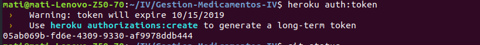
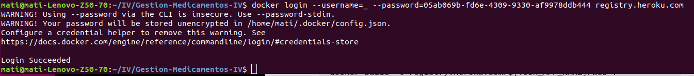
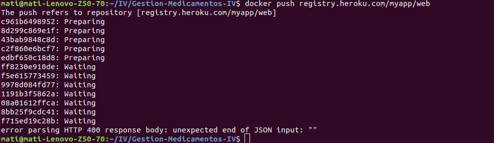

## Despliegue en Heroku de nuestro contenedor Docker, alojado en DockerHub

Seguimos [esta](https://medium.com/travis-on-docker/how-to-run-dockerized-apps-on-heroku-and-its-pretty-great-76e07e610e22) guía.

Obtenemos un token de heroku:

Usamos el token que nos da Heroku para iniciar sesión en el registro de Docker:

Nota: el correo electrónico y el nombre de usuario son en realidad el guión bajo, no los cambies.

Para finalizar subimos nuestra imagen:

    docker build -t registry.heroku.com/${YOUR_APP_NAME}/web .
    docker push registry.heroku.com/${YOUR_APP_NAME}/web

Comprobamos desde Heroku:
