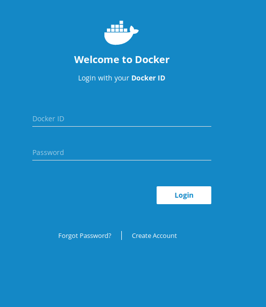
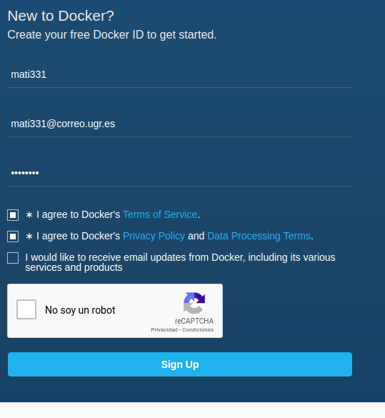
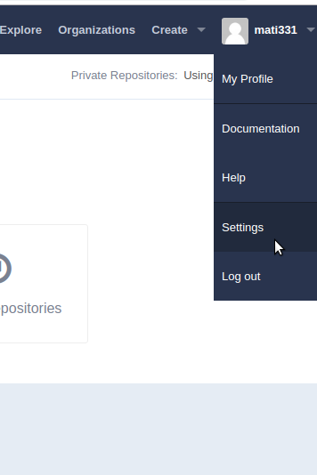
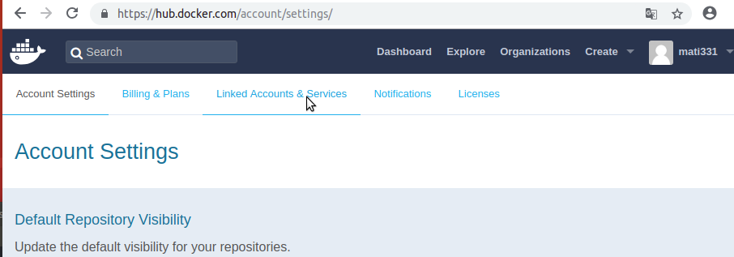
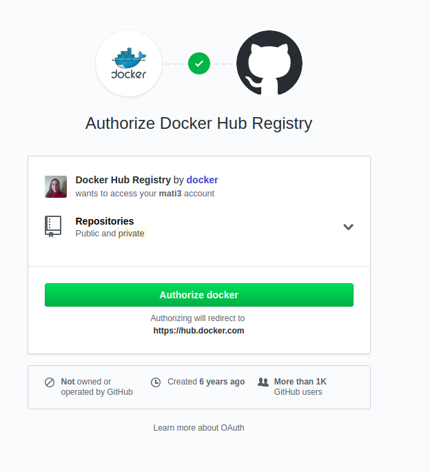
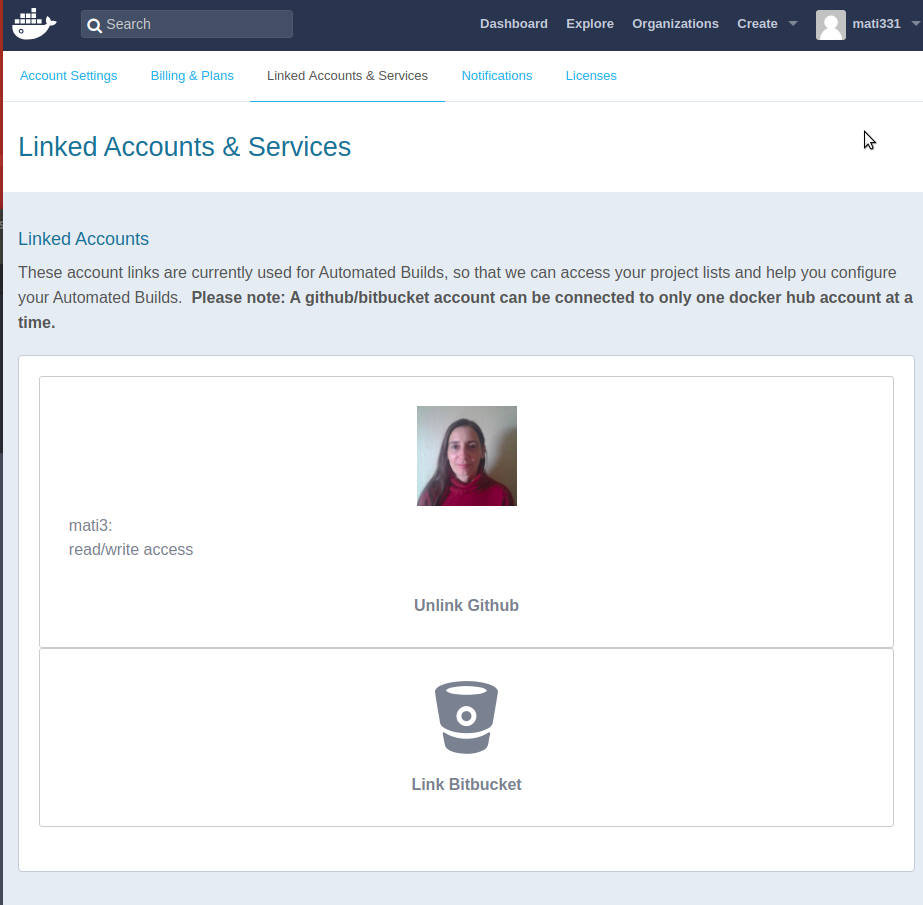
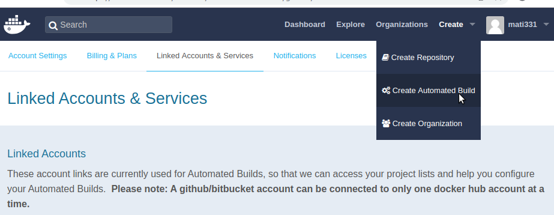
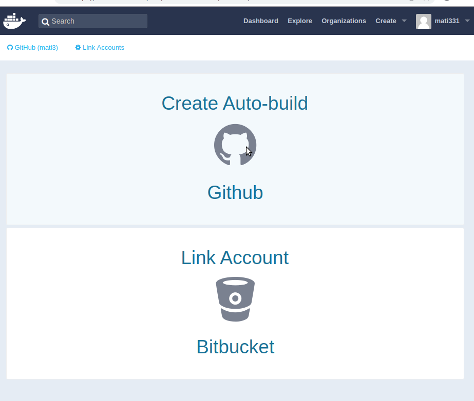
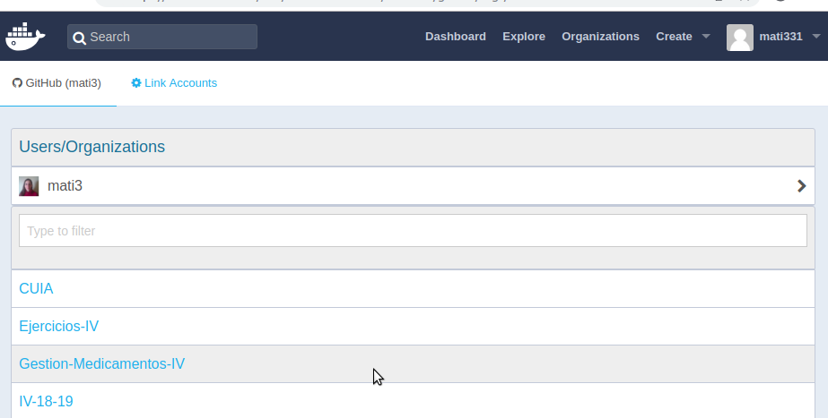
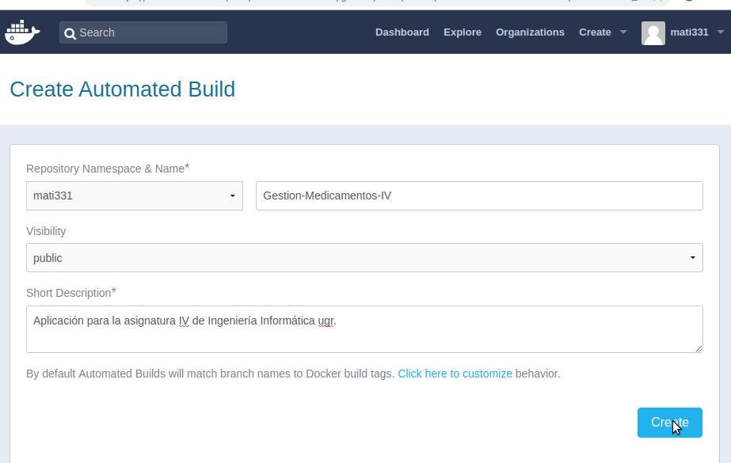

## Docker Hub y despliegue en Heroku

Vamos a la pagina oficial de [docker hub](https://id.docker.com/login/?next=%2Fid%2Foauth%2Fauthorize%2F%3Fclient_id%3D43f17c5f-9ba4-4f13-853d-9d0074e349a7%26next%3Dhttps%253A%252F%252Fhub.docker.com%252F%26nonce%3DeyJhbGciOiJIUzI1NiIsInR5cCI6IkpXVCJ9.eyJhdWQiOiI0M2YxN2M1Zi05YmE0LTRmMTMtODUzZC05ZDAwNzRlMzQ5YTciLCJleHAiOjE1NDIxMjk4OTYsImlhdCI6MTU0MjEyOTU5NiwicmZwIjoidEoyQTlBQkw4VnkwTlU5bXM1SVAyUT09IiwidGFyZ2V0X2xpbmtfdXJpIjoiaHR0cHM6Ly9odWIuZG9ja2VyLmNvbS8ifQ.Us2YDlh9E4KNoYe7inJWICbT0uFNsNx5wf2mnVM7NvU%26redirect_uri%3Dhttps%253A%252F%252Fhub.docker.com%252Fsso%252Fcallback%26response_type%3Dcode%26scope%3Dopenid%26state%3DeyJhbGciOiJIUzI1NiIsInR5cCI6IkpXVCJ9.eyJhdWQiOiI0M2YxN2M1Zi05YmE0LTRmMTMtODUzZC05ZDAwNzRlMzQ5YTciLCJleHAiOjE1NDIxMjk4OTYsImlhdCI6MTU0MjEyOTU5NiwicmZwIjoidEoyQTlBQkw4VnkwTlU5bXM1SVAyUT09IiwidGFyZ2V0X2xpbmtfdXJpIjoiaHR0cHM6Ly9odWIuZG9ja2VyLmNvbS8ifQ.Us2YDlh9E4KNoYe7inJWICbT0uFNsNx5wf2mnVM7NvU) y accedemos a "Create Account"

Le indicamos nuestras credenciales, nos enviara un correo y tras confirmar nuestro correo ya podremos acceder a nuestra cuenta docker-hub

Nos dirigimos a “Settings” :

A “Linked Accounts & Services”:

Elegimos GitHub, accedemos a select en “Public and Private” y  autorizamos GitHub:

Comprobamos nuestro enlace a GitHub

Vamos a "create" -> "create automated build"

Elegimos el proyecto de GitHub:

Finalmente queda configurado docker hub:

Para interactuar con docker hub desde terminal hemos encontrado [este enlace](https://carloszr.com/crear-cuenta-docker-hub-subir-imagen/)

Enlace a [despliegue en Heroku](https://github.com/mati3/Gestion-Medicamentos-IV/blob/master/doc/docker-heroku.md) de nuestro contenedor Docker, alojado en DockerHub
