## Despliegue en heroku

Darse de alta en heroku

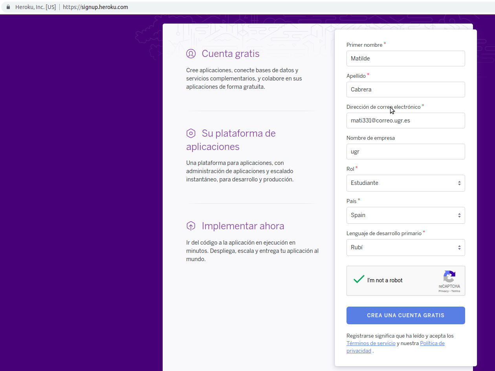

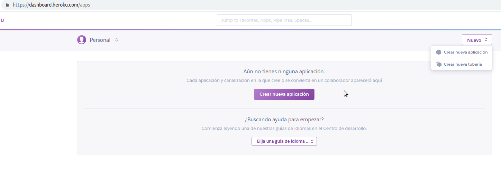

Crear la aplicación y enlazarla a nuestro proyecto en git.

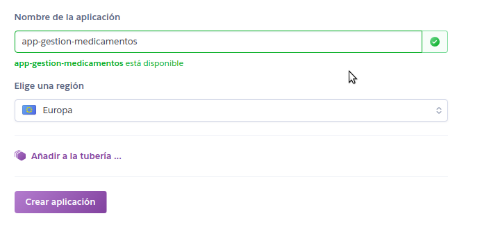

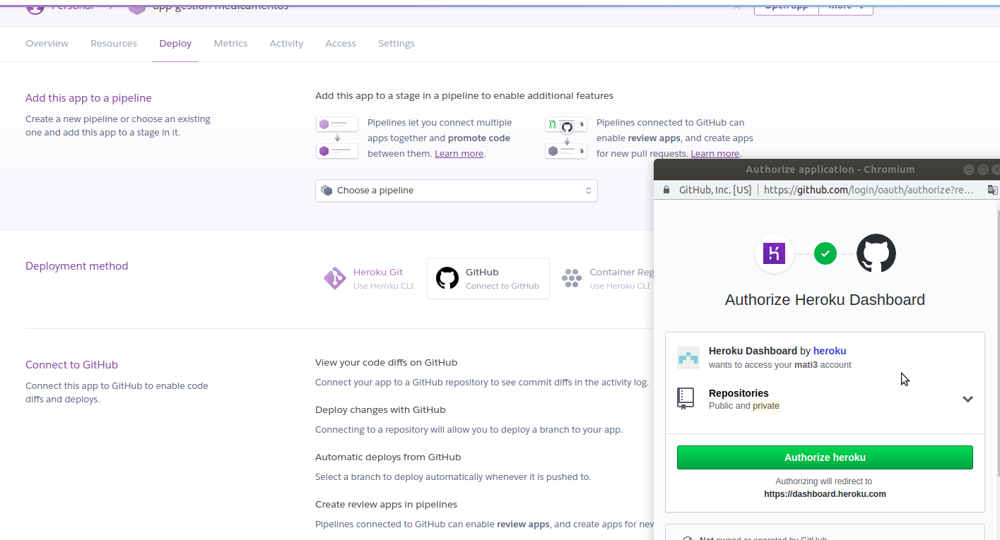

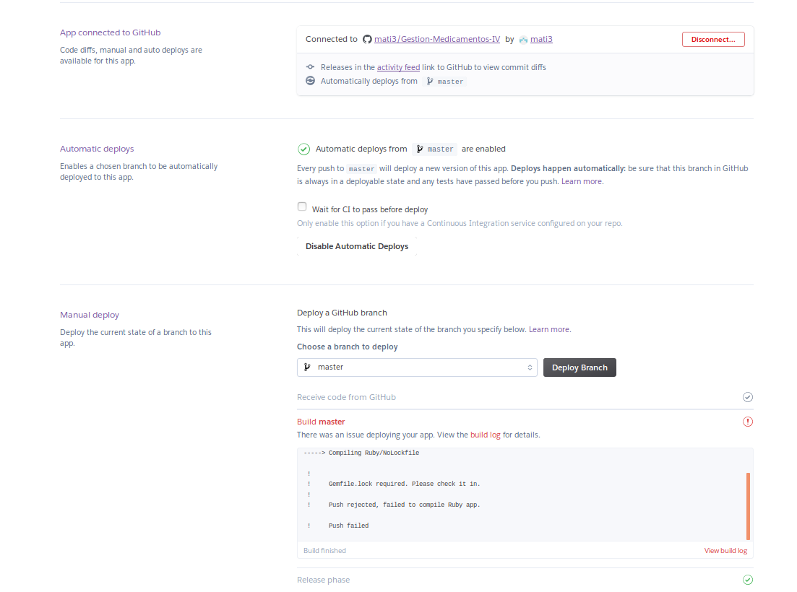

Podemos ver que requiere el archivo gemfile.lock. Para generar dicho archivo desde linea de comando ejecutamos bundle install, lo agregamos a nuestro proyecto.

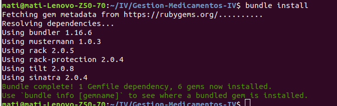

Ya tenemos la respuesta esperada:

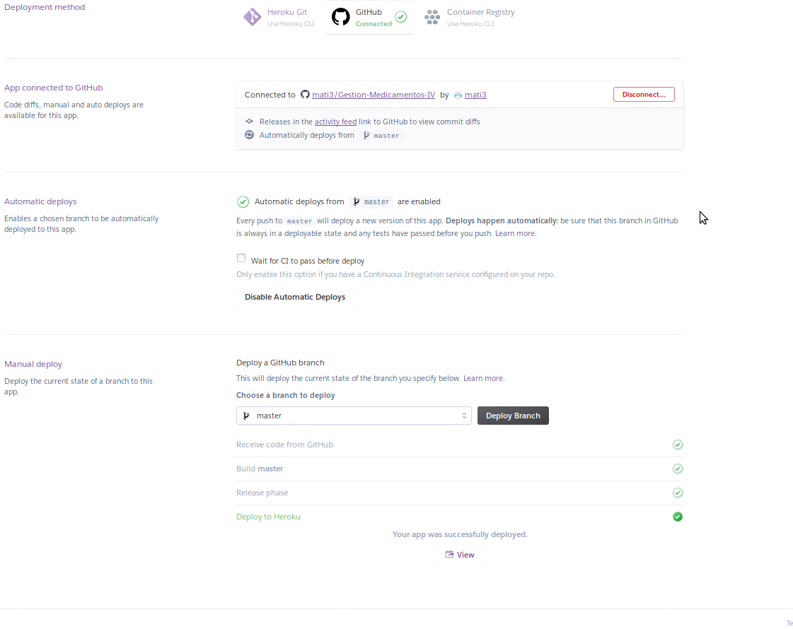

** Documentos necesarios **

Necesita un archivo Procfile junto con su config.ru para decirle a Heroku cómo ejecutar su aplicación.

 * [procfile](https://devcenter.heroku.com/articles/procfile#deploying-to-heroku)

        require 'rubygems'
        require 'sinatra'
        require 'bundler'

        Bundler.require

        require './sinatra/myapp'
        run Sinatra::Application

 * [config.ru](https://devcenter.heroku.com/articles/rack)

        web: rackup

### Tenemos dos formas de iniciar la aplicación:

 ** Desde el navegador **

** Desde la terminal: **

* heroku login

      heroku: Enter your login credentials
      Email [mati331@correo.ugr.es]:
      Password: ********
      Logged in as mati331@correo.ugr.es

* heroku create app-gestion-medicamentos

      Creating ⬢ app-gestion-medicamentos... !
      Name app-gestion-medicamentos is already taken

** se puede probar de forma local o remota **

** Local **

* heroku local web

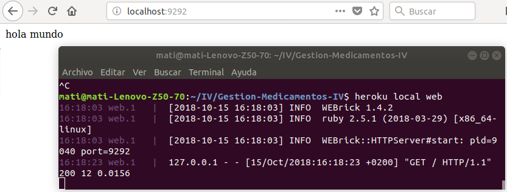

** Remota **

* git push heroku master

* heroku open

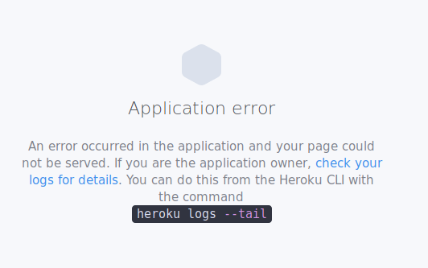

Tanto desde la web como desde terminal, de forma remota nos da el mismo error. buscando en los log, el tiempo de espera determinado para el servidor sobrepasa el limite esperado y la aplicación aborta.

Podemos ver log directamente en la web, open app / more --> view logs

Ver los log en la [terminal](https://devcenter.heroku.com/articles/logging)

heroku logs

heroku logs -n 200  //los ultimos 200 logs

* Codigos de error en [heroku](https://devcenter.heroku.com/articles/error-codes)

* warning de la terminal, especificar la [version de ruby](https://devcenter.heroku.com/articles/ruby-versions)

### Para terminar vamos a incluir un json para que nos devuelva "status ok"

** Ahora nuestro archivo sinatra/myapp.ruby tiene este aspecto **

      require 'sinatra'
      require 'json'

        get '/' do
          content_type :json
      	{:status => 'ok'}.to_json

        end

* Lo probamos de forma local:

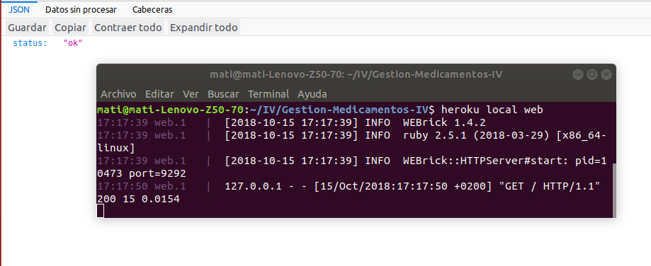

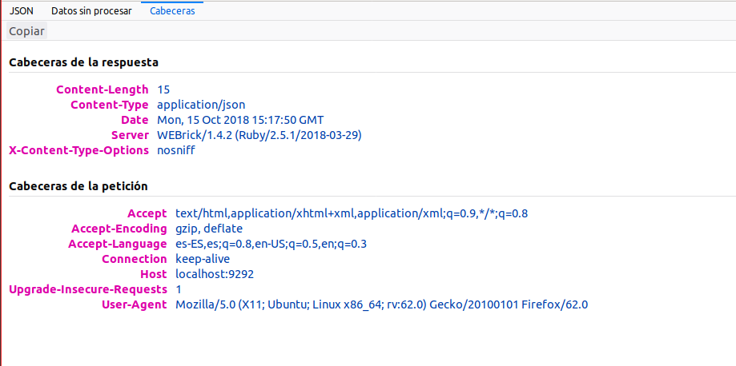
